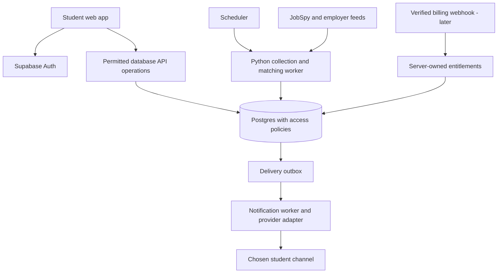

# Role Ping — Architecture and data model

Status: Recommended architecture, not an implemented deployment.

## System boundary

Use a responsive frontend, Supabase Auth/Postgres, and a separately hosted scheduled Python worker. The frontend framework and hosting vendor remain undecided. No separate Django/FastAPI service is necessary for basic profile and shortlist operations. Managed database APIs handle permitted browser reads/writes; privileged operations run in workers or small server-side functions.

This is “no dedicated backend framework,” not “no backend.” Scraping cannot safely depend on a browser session. Keep Python JobSpy in its own runtime; choose worker hosting based on measured timeouts, scheduling, outbound access, and cost. Short server functions can handle webhooks or privileged commands. Check current [Supabase function limits](https://supabase.com/docs/guides/functions/limits) before assigning work to them; this design does not depend on a particular advertised timeout.

## Components

| Component | Responsibility | Deliberate boundary |
|---|---|---|
| Frontend | Onboarding, preferences, shortlist, actions, delivery settings | Cannot write source jobs, matches, billing state, or administrator roles |
| Supabase | Identity, durable records, authorised data access | Does not itself supply JobSpy or job coverage |
| Python worker | Collect, normalise, validate, deduplicate, match | Reuses shared collections across students |
| Scheduler | Trigger bounded runs; avoid overlapping leases | Does not execute unbounded crawling inside the database |
| Outbox worker | Read due deliveries and send through adapters | Rechecks consent, entitlement, status, and deduplication |
| Operator interface | Source health and review queue | Separate authenticated operator permissions |

Firebase remains an alternative if existing team expertise strongly favours it. Supabase is recommended because the product has related students, preferences, jobs, sources, matches, actions, and deliveries. No migration between platforms has been authorised or performed.

## Conceptual data model

This is a logical schema, not a runnable migration. Final column types and indexes follow query patterns and implementation tests.

| Entity | Key fields / relationships | Write owner |
|---|---|---|
| profiles | user_id, education, branch, graduation_year, status, experience, skills, availability | Student for own editable fields |
| preferences | user_id, role_types, target_roles, locations, exclusions, work_mode, salary_floor/currency/period, unknown policies, version | Student |
| notification_settings | user_id, timezone, schedule, quiet_hours, channel, paused, max_alerts | Student; verified status is server-owned |
| channel_destinations | user_id, channel, destination, verification status | Server after verification; private |
| consent_events | user_id, purpose, channel, granted/revoked, timestamp, version | Server records validated user action |
| employers | employer_id, name, domain, ATS board identifier | Operator/worker |
| sources | source_id, type, enabled, cadence, access conditions, health | Operator/worker |
| collection_runs | run_id, source_id, start/end, outcome, counts, error_class, connector_version | Worker |
| source_postings | source_id + external_id, canonical_job_id, source_url, content_hash, first_seen/last_seen, raw pointer | Worker |
| jobs | job_id, employer_id, canonical fields, evidence, status, conflict flags, timestamps | Worker/operator |
| matches | user_id + job_id, eligibility_state, score, reasons, preference_version, engine_version | Worker |
| user_job_actions | user_id + job_id, saved, applied_at, dismissed_at | Student |
| feedback | user_id, job_id, reason, optional text, reviewed_at | Student creates; operator reviews |
| entitlements | user_id, plan, effective dates, billing reference | Verified server process only |
| delivery_batches | batch_id, user_id, schedule slot, channel, lifecycle state | Worker |
| delivery_items | batch_id, job_id, eligibility snapshot, duplicate guard | Worker |
| delivery_attempts | batch_id, attempt, provider_id, status, error, timestamps | Worker |

Suggested uniqueness: source/external ID; user/canonical job match; user/job action; user/channel/schedule slot for daily batches; provider event ID for billing. Use a separate uniqueness key for instant delivery per user/canonical job/delivery policy version. Do not use a job title as a primary key.

Public job content and private student records must remain separate. Store raw responses only where necessary and with a defined expiry; do not expose them to the browser. Resume files are optional and deferred, so storage upload infrastructure is not a launch dependency.

## Browser access policy

Enable RLS and deliberate grants for exposed tables. Students read/update only their own profile, preferences, settings, and actions; they read only their own matches. Jobs are client-read-only through a curated representation. Entitlements, raw records, operational logs, and delivery state are server-written. Read grants for entitlements must expose only the user's permitted plan information. Views require their own access review. See [Supabase RLS documentation](https://supabase.com/docs/guides/database/postgres/row-level-security).

Use frontend publishable credentials only. Never expose service/secret credentials. Do not trust user-editable metadata for operator roles or payment status. Enforce ownership for both existing and proposed rows on updates. Policies must prevent changing user_id to take over another account's records. Deleting an account must also stop queued delivery and address active sessions; deletion of a profile row alone is not a complete lifecycle operation.

The worker should use the narrowest practical database privileges. If a privileged credential is required initially, contain it in the worker secret store and review its access. This is a design requirement, not evidence that deployed policies have been verified.

## Operational model

- Separate collection from delivery schedules. A free daily digest does not require collecting only once a day.
- Proposed pilot cadence: selected employer feeds every 30–60 minutes and job-board searches every few hours, subject to source limits and measured cost. These intervals are not a promised SLA or final setting.
- Use per-source rate limits, run leases, bounded retries, and an error queue for manual review.
- Write job updates transactionally. Mark a run complete only after pagination and writes complete; partial runs must not imply all absent jobs closed.
- Queue changes after a profile preference version changes and prevent stale matches from being delivered.
- Record structured operational events without resumes, contact details, or full descriptions in routine logs.
- Pin dependencies, retain parser fixtures, and run smoke checks before connector upgrades.
- Keep backup/restore and recovery procedures appropriate to the eventual hosting plan; verify restoration before a paid launch.

## Retention proposal

Proposed pilot defaults: raw fetch artifacts up to 30 days, operational delivery/run logs up to 90 days, personal profile/activity while the account is active. Account deletion removes or de-identifies related personal records and pending messages. Legally required billing records, if later applicable, need an explicit separate policy. These durations are proposals to finalise before onboarding, not a statement of applicable law.

## When to add a dedicated backend API

Add one when there are multiple clients, substantial synchronous business logic, an external developer product, complex privileged workflows, or measured limitations in the current design. Keep connector and matching interfaces modular now; defer a public SDK until external developers are a real audience.
